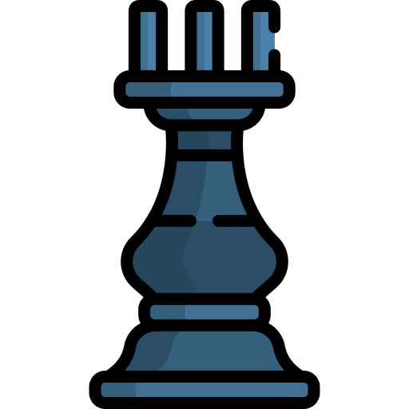
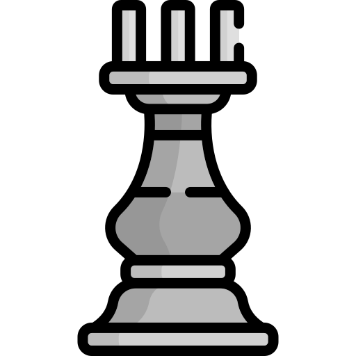
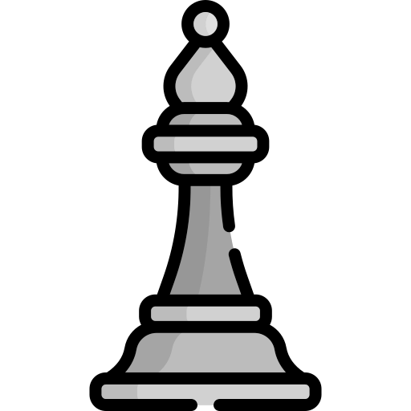

# GitHub README Chess Tournament

This is an open chess tournament where ANYONE can play. That's the fun part.  
It's your turn to play! Move a <!-- BEGIN TURN -->white<!-- END TURN --> piece.

<!-- BEGIN CHESS BOARD -->
|   | A | B | C | D | E | F | G | H |   |
|---|:-:|:-:|:-:|:-:|:-:|:-:|:-:|:-:|:-:|
| **8** |  |  |  |  |  |  |  |  | **8** |
| **7** |  |  |  |  |  |  |  |  | **7** |
| **6** |  |  |  |  |  |  |  |  | **6** |
| **5** |  |  |  |  |  |  |  |  | **5** |
| **4** |  |  |  |  |  |  |  |  | **4** |
| **3** |  |  |  |  |  |  |  |  | **3** |
| **2** |  |  |  |  |  |  |  |  | **2** |
| **1** |  |  |  |  |  |  |  |  | **1** |
|   | **A** | **B** | **C** | **D** | **E** | **F** | **G** | **H** |   |
<!-- END CHESS BOARD -->

**It's your turn to move! Choose one from the following table**
<!-- BEGIN MOVES LIST -->
|  FROM  | TO (Just click a link!) |
| :----: | :---------------------- |
| **A1** | [A2](https://github.com/himagandhii/himagandhii/issues/new?body=Please+do+not+change+the+title.+Just+click+%22Submit+new+issue%22.+You+don%27t+need+to+do+anything+else+%3AD&title=Chess%3A+Move+A1+to+A2) |
| **B1** | [C3](https://github.com/himagandhii/himagandhii/issues/new?body=Please+do+not+change+the+title.+Just+click+%22Submit+new+issue%22.+You+don%27t+need+to+do+anything+else+%3AD&title=Chess%3A+Move+B1+to+C3), [D2](https://github.com/himagandhii/himagandhii/issues/new?body=Please+do+not+change+the+title.+Just+click+%22Submit+new+issue%22.+You+don%27t+need+to+do+anything+else+%3AD&title=Chess%3A+Move+B1+to+D2) |
| **B2** | [B3](https://github.com/himagandhii/himagandhii/issues/new?body=Please+do+not+change+the+title.+Just+click+%22Submit+new+issue%22.+You+don%27t+need+to+do+anything+else+%3AD&title=Chess%3A+Move+B2+to+B3), [B4](https://github.com/himagandhii/himagandhii/issues/new?body=Please+do+not+change+the+title.+Just+click+%22Submit+new+issue%22.+You+don%27t+need+to+do+anything+else+%3AD&title=Chess%3A+Move+B2+to+B4) |
| **C1** | [D2](https://github.com/himagandhii/himagandhii/issues/new?body=Please+do+not+change+the+title.+Just+click+%22Submit+new+issue%22.+You+don%27t+need+to+do+anything+else+%3AD&title=Chess%3A+Move+C1+to+D2), [E3](https://github.com/himagandhii/himagandhii/issues/new?body=Please+do+not+change+the+title.+Just+click+%22Submit+new+issue%22.+You+don%27t+need+to+do+anything+else+%3AD&title=Chess%3A+Move+C1+to+E3), [F4](https://github.com/himagandhii/himagandhii/issues/new?body=Please+do+not+change+the+title.+Just+click+%22Submit+new+issue%22.+You+don%27t+need+to+do+anything+else+%3AD&title=Chess%3A+Move+C1+to+F4), [G5](https://github.com/himagandhii/himagandhii/issues/new?body=Please+do+not+change+the+title.+Just+click+%22Submit+new+issue%22.+You+don%27t+need+to+do+anything+else+%3AD&title=Chess%3A+Move+C1+to+G5) |
| **C2** | [C3](https://github.com/himagandhii/himagandhii/issues/new?body=Please+do+not+change+the+title.+Just+click+%22Submit+new+issue%22.+You+don%27t+need+to+do+anything+else+%3AD&title=Chess%3A+Move+C2+to+C3), [C4](https://github.com/himagandhii/himagandhii/issues/new?body=Please+do+not+change+the+title.+Just+click+%22Submit+new+issue%22.+You+don%27t+need+to+do+anything+else+%3AD&title=Chess%3A+Move+C2+to+C4) |
| **D1** | [D2](https://github.com/himagandhii/himagandhii/issues/new?body=Please+do+not+change+the+title.+Just+click+%22Submit+new+issue%22.+You+don%27t+need+to+do+anything+else+%3AD&title=Chess%3A+Move+D1+to+D2), [D3](https://github.com/himagandhii/himagandhii/issues/new?body=Please+do+not+change+the+title.+Just+click+%22Submit+new+issue%22.+You+don%27t+need+to+do+anything+else+%3AD&title=Chess%3A+Move+D1+to+D3) |
| **D4** | [D5](https://github.com/himagandhii/himagandhii/issues/new?body=Please+do+not+change+the+title.+Just+click+%22Submit+new+issue%22.+You+don%27t+need+to+do+anything+else+%3AD&title=Chess%3A+Move+D4+to+D5) |
| **E1** | [D2](https://github.com/himagandhii/himagandhii/issues/new?body=Please+do+not+change+the+title.+Just+click+%22Submit+new+issue%22.+You+don%27t+need+to+do+anything+else+%3AD&title=Chess%3A+Move+E1+to+D2) |
| **E2** | [E3](https://github.com/himagandhii/himagandhii/issues/new?body=Please+do+not+change+the+title.+Just+click+%22Submit+new+issue%22.+You+don%27t+need+to+do+anything+else+%3AD&title=Chess%3A+Move+E2+to+E3), [E4](https://github.com/himagandhii/himagandhii/issues/new?body=Please+do+not+change+the+title.+Just+click+%22Submit+new+issue%22.+You+don%27t+need+to+do+anything+else+%3AD&title=Chess%3A+Move+E2+to+E4) |
| **F1** | [G2](https://github.com/himagandhii/himagandhii/issues/new?body=Please+do+not+change+the+title.+Just+click+%22Submit+new+issue%22.+You+don%27t+need+to+do+anything+else+%3AD&title=Chess%3A+Move+F1+to+G2), [H3](https://github.com/himagandhii/himagandhii/issues/new?body=Please+do+not+change+the+title.+Just+click+%22Submit+new+issue%22.+You+don%27t+need+to+do+anything+else+%3AD&title=Chess%3A+Move+F1+to+H3) |
| **F2** | [F3](https://github.com/himagandhii/himagandhii/issues/new?body=Please+do+not+change+the+title.+Just+click+%22Submit+new+issue%22.+You+don%27t+need+to+do+anything+else+%3AD&title=Chess%3A+Move+F2+to+F3), [F4](https://github.com/himagandhii/himagandhii/issues/new?body=Please+do+not+change+the+title.+Just+click+%22Submit+new+issue%22.+You+don%27t+need+to+do+anything+else+%3AD&title=Chess%3A+Move+F2+to+F4) |
| **G1** | [F3](https://github.com/himagandhii/himagandhii/issues/new?body=Please+do+not+change+the+title.+Just+click+%22Submit+new+issue%22.+You+don%27t+need+to+do+anything+else+%3AD&title=Chess%3A+Move+G1+to+F3), [H3](https://github.com/himagandhii/himagandhii/issues/new?body=Please+do+not+change+the+title.+Just+click+%22Submit+new+issue%22.+You+don%27t+need+to+do+anything+else+%3AD&title=Chess%3A+Move+G1+to+H3) |
| **H2** | [H3](https://github.com/himagandhii/himagandhii/issues/new?body=Please+do+not+change+the+title.+Just+click+%22Submit+new+issue%22.+You+don%27t+need+to+do+anything+else+%3AD&title=Chess%3A+Move+H2+to+H3), [H4](https://github.com/himagandhii/himagandhii/issues/new?body=Please+do+not+change+the+title.+Just+click+%22Submit+new+issue%22.+You+don%27t+need+to+do+anything+else+%3AD&title=Chess%3A+Move+H2+to+H4) |
<!-- END MOVES LIST -->

Having fun? Ask a friend to do the next move!

#### How it works

When you click on a link and submit a new issue with the desired move, a GitHub action is triggered, which in turn runs a small python script that performs the specified movement, updates this README file and commits the changes.

Have you spotted a bug? Something missing? Feel free to open an [issue](https://github.com/marcizhu/readme-chess/issues) and I will try to fix it as soon as possible :D

  
Last 5 moves in this game

<!-- BEGIN LAST MOVES -->

| Move | Author |
| :--: | :----- |
| `G7` to `G5` | [ @himagandhii](https://github.com/himagandhii) |
| `D2` to `D4` | [ @Mehtaab11](https://github.com/Mehtaab11) |
| `A5` to `A4` | [ @Ashwin543](https://github.com/Ashwin543) |
| `G2` to `G4` | [ @himagandhii](https://github.com/himagandhii) |
| `A7` to `A5` | [ @Mr-codehunter](https://github.com/Mr-codehunter) |

<!-- END LAST MOVES -->

  
Top 10 most moves across all games

<!-- BEGIN TOP MOVES -->

| Total moves |  User  |
| :---------: | :----- |
| 3 | [@himagandhii](https://github.com/himagandhii) |
| 1 | [@Mr-codehunter](https://github.com/Mr-codehunter) |
| 1 | [@Ashwin543](https://github.com/Ashwin543) |
| 1 | [@Mehtaab11](https://github.com/Mehtaab11) |

<!-- END TOP MOVES -->

---

Do you want to make your own? Check out [marcizhu/readme-chess](https://github.com/marcizhu/readme-chess)!

# Hi! there 👋

<!--
**himagandhii/himagandhii** is a ✨ _special_ ✨ repository because its `README.md` (this file) appears on your GitHub profile.

Here are some ideas to get you started:

- 🔭 I’m currently working on... 
- 🌱 I’m currently learning: Java
- 👯 I’m looking to collaborate on: P
- 🤔 I’m looking for help with ...
- 💬 Ask me about ...
- 📫 How to reach me: ...
- 😄 Pronouns: ...
- ⚡ Fun fact: ...
I'm Hima Gandhi.

 <i>Currently:</i> 3nd Year Information Technology Student at Guru Nanak Dev Engineering College. 
-->

## Hi there I'm Hima Gandhi.
  
- 🌱 I’m currently learning Java
- 👯 I’m looking to collaborate on Machine learning projects
- 🤔 I’m looking for help with Python
- 💬 Ask me about C,C++,Html,Css,Javascript,Dbms,Os
- 📫 How to reach me https://github.com/himagandhii
- ⚡ Fun fact: I love chess and music

<h2>👀 Stats</h2>

  

  <b><em>Overall GitHub Stats:</em></b>  
       
      
  

